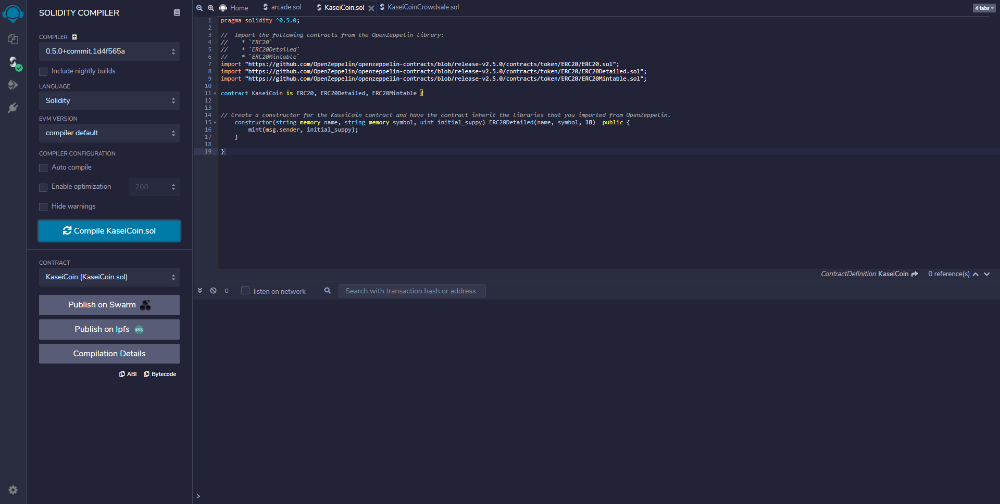

# KaseiCoinFungibleToken

## Overview
KaseiCoin is a fungible token and ERC-20 compliant and is mint by using KaseiCoinCrowdsale a crowdsale contract.
The crowdsale contract manages the entire crowdsale process, allowing users to send ether to the contract and in return receive KAI tokens. The contract mints the tokens automatically and distribute them to buyers in one transaction.
## Usage

Screenshots demonstrating the usage of this contract are attached below.

The KaseiCoin Fungible Token contract compilation:

The KaseiCoinCrowdsale contract compilation:

---

## Contributors

Brought to you by Carlos R. you may reach me at reachcarlostoday@gmail.com

---

## License

MIT.
